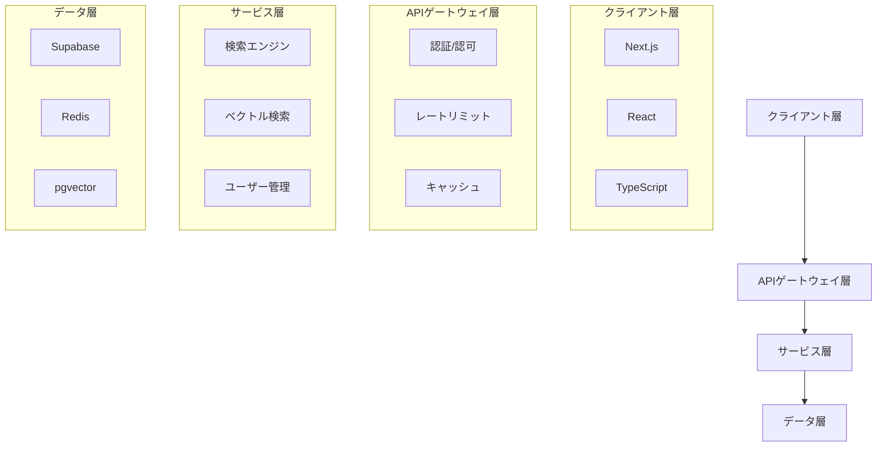

# 技術アーキテクチャ設計書

## 1. システム概要図



## 2. コンポーネント設計

### 2.1 フロントエンド

#### 2.1.1 コアコンポーネント
- SearchBar: メインの検索インターフェース
- ResultList: 検索結果表示
- FilterPanel: 検索フィルター
- UserDashboard: ユーザー管理画面

#### 2.1.2 状態管理
- React Query: サーバー状態管理
- Context API: アプリケーション状態
- Local Storage: ユーザー設定保存

#### 2.1.3 ルーティング
- Next.js Pages Router
- 動的ルーティング
- ミドルウェア統合

### 2.2 バックエンド

#### 2.2.1 APIエンドポイント
```typescript
/api/
  ├── search/
  │   ├── query      # 基本検索
  │   ├── vector     # ベクトル検索
  │   └── suggest    # サジェスト
  ├── user/
  │   ├── profile    # プロフィール管理
  │   ├── history    # 検索履歴
  │   └── settings   # 設定
  └── admin/
      ├── metrics    # システム統計
      ├── users      # ユーザー管理
      └── content    # コンテンツ管理
```

#### 2.2.2 サービス層
- SearchService: 検索ロジック
- VectorService: ベクトル変換
- UserService: ユーザー管理
- CacheService: キャッシュ制御

#### 2.2.3 データアクセス層
- SupabaseClient: データベース操作
- RedisClient: キャッシュ管理
- VectorStore: ベクトルデータ管理

## 3. データモデル

### 3.1 データベーススキーマ
```sql
-- 既存のスキーマ（0000_initial_schema.sql）を拡張

-- ユーザー設定テーブル
create table public.user_settings (
    user_id uuid references auth.users primary key,
    preferences jsonb default '{}',
    created_at timestamptz default now(),
    updated_at timestamptz default now()
);

-- 検索履歴の拡張
alter table public.search_queries
add column metadata jsonb default '{}';

-- ベクトルインデックスの最適化
create index vector_documents_metadata_idx on public.vector_documents using gin (metadata);
```

### 3.2 キャッシュ戦略
```typescript
// キャッシュキー構造
{
  search: {
    query: `search:${queryHash}`,
    vector: `vector:${vectorHash}`,
    suggest: `suggest:${partialQuery}`
  },
  user: {
    profile: `user:${userId}:profile`,
    settings: `user:${userId}:settings`,
    history: `user:${userId}:history`
  }
}

// TTL設定
const TTL = {
  search: 3600,        // 1時間
  vector: 86400,       // 24時間
  suggest: 1800,       // 30分
  userProfile: 300,    // 5分
  userSettings: 600    // 10分
};
```

## 4. セキュリティ設計

### 4.1 認証・認可
- Supabase Auth
- JWTトークン
- Row Level Security (RLS)

### 4.2 データ保護
- TLS 1.3
- データ暗号化
- セキュアセッション管理

### 4.3 アクセス制御
```sql
-- RLSポリシーの拡張
create policy "Users can manage their settings"
on public.user_settings
for all using (auth.uid() = user_id);

-- レート制限の実装
create function check_rate_limit(user_id uuid)
returns boolean as $$
begin
  -- レート制限のロジック
end;
$$ language plpgsql;
```

## 5. スケーリング戦略

### 5.1 水平スケーリング
- Supabaseのレプリケーション
- Redisクラスター
- ステートレスなAPIサーバー

### 5.2 パフォーマンス最適化
- インデックス最適化
- クエリチューニング
- キャッシュ戦略

### 5.3 監視・アラート
- メトリクス収集
- パフォーマンスモニタリング
- エラー追跡

## 6. デプロイメント

### 6.1 コンテナ化
```dockerfile
# Dockerfileの基本構造
FROM node:18-alpine

# 開発環境
FROM base as development
ENV NODE_ENV=development
# 開発用設定

# 本番環境
FROM base as production
ENV NODE_ENV=production
# 本番用設定
```

### 6.2 CI/CD
- GitHub Actions
- 自動テスト
- 自動デプロイ

### 6.3 環境分離
- 開発環境
- ステージング環境
- 本番環境

## 7. 運用保守

### 7.1 バックアップ戦略
- 定期バックアップ
- ポイントインタイムリカバリ
- 障害復旧手順

### 7.2 モニタリング
- システムメトリクス
- アプリケーションログ
- ユーザー行動分析

### 7.3 パフォーマンスチューニング
- 定期的な性能評価
- ボトルネック分析
- 最適化施策の実施